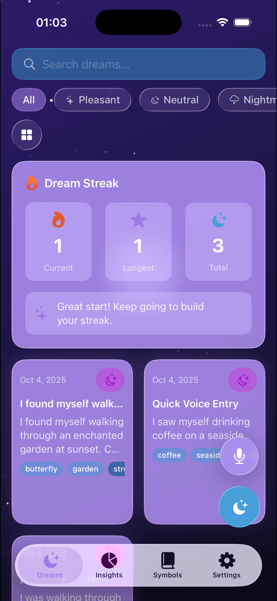

# 🌙 NightTales - AI Dream Journal

<p align="center">
  
</p>

<p align="center">
  <strong>Interpret your dreams with Apple Intelligence</strong><br>
  A beautiful, privacy-first dream journal for iOS 26+
</p>

<p align="center">
  
  
  
  
</p>

---

## ✨ Features

### 🤖 AI-Powered Dream Interpretation
- **On-Device Intelligence**: All AI processing happens on your device using Apple's Foundation Models
- **Deep Analysis**: Psychological, symbolic, and cultural dream interpretations
- **Symbol Detection**: Automatically identifies and tracks important dream symbols
- **Pattern Recognition**: Discovers recurring themes and emotional trends across your dreams

### 📝 Dream Recording
- **Text Entry**: Write your dreams with a beautiful, distraction-free editor
- **Voice Recording**: Quickly capture dreams using speech-to-text (on-device transcription)
- **Mood Tracking**: Tag dreams with 5 different moods (Pleasant, Neutral, Nightmare, Lucid, Confusing)
- **Lucid Dream Marking**: Track your lucid dreaming progress

### 📊 Insights & Analytics
- **Dream Streak**: Gamification to encourage daily dream journaling
- **Mood Distribution**: Visualize emotional patterns with beautiful charts
- **Symbol Cloud**: Discover your most frequent dream symbols
- **Pattern Analysis**: AI-generated insights about your dream patterns

### 🗂️ Symbol Library
- **Personal Dictionary**: Build your own dream symbol encyclopedia
- **Category Organization**: Symbols organized by type (People, Animals, Nature, Objects, Emotions, Places)
- **Frequency Tracking**: See how often symbols appear in your dreams
- **Meanings & Context**: AI-generated symbolic interpretations

### 🔮 Beautiful Design
- **Liquid Glass UI**: Native iOS 26 Liquid Glass design system throughout
- **Mystical Theme**: Dark mode with cosmic colors (purple, blue, pink gradients)
- **Smooth Animations**: Spring-based animations and particle effects
- **Haptic Feedback**: Tactile responses for key interactions

### 🔒 Privacy & Security
- **100% On-Device**: All AI processing and data storage stays on your device
- **No Cloud Sync**: Your dreams never leave your iPhone
- **SwiftData**: Modern local persistence with zero external dependencies
- **Export/Import**: Backup your data as JSON files

---

## 📸 Screenshots

### Home Screen
  

*Dream library with grid and list layouts, featuring Liquid Glass cards and mood indicators*

### New Dream Entry
 

*Beautiful dream entry form with voice recording and AI interpretation*

### Dream Detail


*Detailed view with full interpretation, detected symbols, and sharing options*

### Insights Dashboard
  

*Analytics with mood distribution, symbol cloud, and pattern analysis*

### Symbol Library
  

*Personal symbol dictionary with categories and meanings*

### Settings & Onboarding
  

*Settings with data management and beautiful onboarding experience*

---

## 🏗️ Architecture

### Tech Stack
- **Language**: Swift 5.9+
- **UI Framework**: SwiftUI
- **Persistence**: SwiftData (iOS 26)
- **AI/ML**: Foundation Models (Apple Intelligence)
- **Speech**: Speech Framework (on-device)
- **Design**: Liquid Glass (iOS 26 native API)

### Project Structure
```
NightTales/
├── App/
│   └── NightTalesApp.swift          # App entry point
├── Core/
│   ├── Models/                       # SwiftData models
│   │   ├── Dream.swift
│   │   ├── DreamMood.swift
│   │   ├── DreamSymbol.swift
│   │   └── DreamPattern.swift
│   ├── Services/                     # Business logic
│   │   ├── AIService.swift           # Apple Intelligence integration
│   │   ├── DreamService.swift        # CRUD operations
│   │   ├── SymbolService.swift       # Symbol management
│   │   ├── VoiceService.swift        # Speech recognition
│   │   └── DataService.swift         # Export/import
│   └── Extensions/                   # Utilities
│       ├── AnimationManager.swift
│       ├── HapticManager.swift
│       ├── ErrorManager.swift
│       └── ShareManager.swift
├── Features/                         # Feature modules (MVVM)
│   ├── Home/
│   ├── NewDream/
│   ├── DreamDetail/
│   ├── Insights/
│   ├── Symbols/
│   ├── Settings/
│   └── Onboarding/
└── UI/
    ├── Components/                   # Reusable components
    │   ├── LiquidGlassButton.swift
    │   ├── LiquidGlassCard.swift
    │   ├── DreamBackground.swift
    │   ├── SymbolBadge.swift
    │   └── MoodIndicator.swift
    └── Theme/                        # Design system
        ├── LiquidGlassStyles.swift
        └── AppColors.swift
```

### Design Patterns
- **MVVM**: Model-View-ViewModel for all features
- **Service Layer**: Centralized business logic
- **SwiftData**: Modern persistence with `@Model` macro
- **@Observable**: Latest Swift concurrency model
- **Dependency Injection**: Services passed via initializers

---

## 🚀 Getting Started

### Requirements
- **iOS 26.0+** (Beta)
- **Xcode 16.0+**
- **Apple Silicon Mac** (for Apple Intelligence development)
- **macOS 15.0+**

### Installation

1. **Clone the repository**
   ```bash
   git clone https://github.com/yourusername/NightTales.git
   cd NightTales
   ```

2. **Open in Xcode**
   ```bash
   open NightTales.xcodeproj
   ```

3. **Select target device**
   - iPhone 15 Pro or newer (real device recommended for AI features)
   - iOS 26.0+ required

4. **Build and Run**
   - ⌘R or click the Run button
   - Grant microphone and speech recognition permissions when prompted

### First Launch
1. Complete the 3-page onboarding tour
2. Record your first dream (text or voice)
3. Tap "Interpret with AI" to see dream analysis
4. Explore detected symbols and patterns

---

## 🎨 Design System

### Liquid Glass
NightTales uses iOS 26's native Liquid Glass API for a modern, translucent interface:

```swift
.glassEffect(.regular.tint(Color.dreamPurple.opacity(0.6)).interactive())
```

### Color Palette
| Color | Hex | Usage |
|-------|-----|-------|
| Dream Purple | `#8B5CF6` | Primary accent, buttons, tints |
| Dream Blue | `#3B82F6` | Secondary accent, charts |
| Dream Pink | `#EC4899` | Highlights, badges |
| Dream Indigo | `#6366F1` | Mood indicators |
| Starlight | `#F0F9FF` | Light accents |
| Moon Glow | `#E0E7FF` | Subtle highlights |

### Typography
- **System Font**: SF Pro (iOS default)
- **Weights**: Light, Medium, Semibold, Bold
- **Sizes**: Caption (12pt) → Large Title (34pt)

### Animations
- **Spring Physics**: Natural, bouncy feel
- **Particle Effects**: Floating stars and cosmic elements
- **Transitions**: Smooth fade/slide combinations

---

## 🤖 Apple Intelligence Integration

### Foundation Models
```swift
import FoundationModels

let session = LanguageModelSession()
let response = try await session.respond(to: prompt)
```

### Features
- **On-Device Processing**: All AI runs locally using the 3B parameter model
- **Privacy First**: No data sent to external servers
- **Async/Await**: Modern concurrency for smooth UX
- **Error Handling**: Graceful fallbacks when AI is unavailable

### Prompts
- **Dream Interpretation**: Psychological and symbolic analysis
- **Symbol Extraction**: Key element detection
- **Pattern Finding**: Recurring theme identification
- **Recommendations**: Personalized insights

---

## 📦 Dependencies

### Native Frameworks
- **SwiftUI**: UI framework
- **SwiftData**: Persistence
- **FoundationModels**: Apple Intelligence
- **Speech**: Voice recognition
- **AVFoundation**: Audio recording
- **UIKit**: Share sheets and utilities

### No Third-Party Dependencies
This project uses **zero external dependencies** for maximum privacy and control.

---

## 🔐 Privacy

### Data Storage
- All dreams stored locally using SwiftData
- No cloud sync or external API calls
- Export as JSON for manual backups

### Permissions Required
- **Microphone**: Voice recording for dreams
- **Speech Recognition**: Voice-to-text transcription

### What We DON'T Collect
- ❌ No analytics or tracking
- ❌ No crash reporting
- ❌ No user identification
- ❌ No cloud uploads
- ❌ No advertising

---

## 🧪 Testing

### Manual Testing Checklist
- [ ] Record dream via text
- [ ] Record dream via voice
- [ ] AI interpretation works
- [ ] Symbols detected correctly
- [ ] Dreams save and load
- [ ] Mood filtering works
- [ ] Search functionality
- [ ] Insights charts display
- [ ] Symbol library populated
- [ ] Export/import data
- [ ] Delete operations
- [ ] Onboarding flow
- [ ] Settings persist

### Known Limitations
- **Apple Intelligence**: Requires iOS 26+ on supported devices (A17 Pro+)
- **Voice Recording**: On-device speech recognition may vary by language
- **AI Safety**: Some dream content may trigger safety guardrails

---

## 🛠️ Development

### Building from Source
```bash
# Clone repository
git clone https://github.com/akinalpfdn/NightTales.git

# Open in Xcode
cd NightTales
open NightTales.xcodeproj

# Select iPhone 15 Pro or newer
# Build: ⌘B
# Run: ⌘R
```

### Code Style
- **SwiftLint**: Follow Swift API design guidelines
- **MVVM**: Consistent architecture pattern
- **Comments**: Minimal inline, comprehensive doc comments
- **Naming**: Descriptive, no abbreviations

### Contributing
1. Fork the repository
2. Create feature branch (`git checkout -b feature/amazing-feature`)
3. Commit changes (`git commit -m 'Add amazing feature'`)
4. Push to branch (`git push origin feature/amazing-feature`)
5. Open Pull Request

---

## 📝 License

This project is licensed under the MIT License - see the [LICENSE](LICENSE) file for details.

---

## 🙏 Acknowledgments

- **Apple**: For Foundation Models, SwiftData, and Liquid Glass APIs
- **SF Symbols**: For beautiful system icons
- **iOS Design Team**: For design inspiration and guidelines

--- 

---

<p align="center">
  Made with 💜 for dreamers everywhere
</p>

<p align="center">
  <sub>🌙 Sweet dreams and happy journaling 🌙</sub>
</p>
